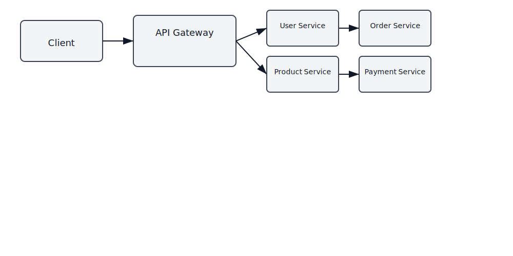
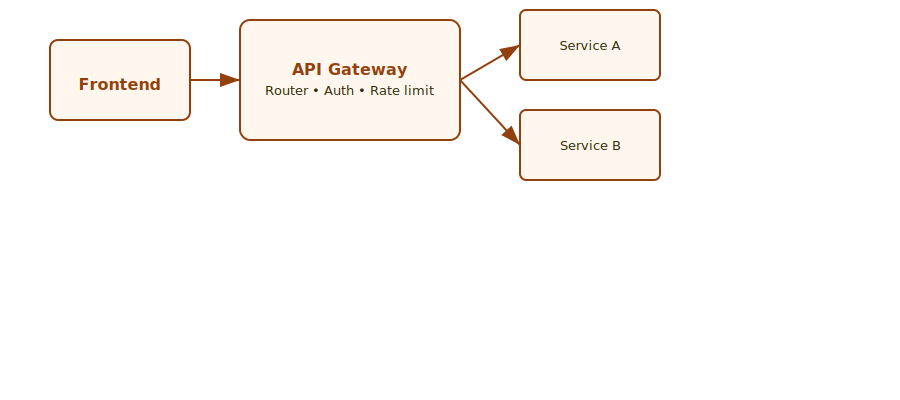

# Presentation de Microservices
**Réalisé par :** <span>Solidev 26</span>  
**Encadré par :** <span>M. ESSARRAJ Fouad</span>  
**Filière :** Développement Mobile et Web

---

## Sommaire

<div class="sommaire-grid">
  <div class="sommaire-item"><div class="sommaire-num">1</div><div>Architecture Monolithique</div></div>
  <div class="sommaire-item"><div class="sommaire-num">2</div><div>Architecture Microservices</div></div>
  <div class="sommaire-item"><div class="sommaire-num">3</div><div>API Gateway</div></div>
  <div class="sommaire-item"><div class="sommaire-num">4</div><div>Conclusion</div></div>
</div>

---

# 1) Architecture Monolithique

## 📌 Définition

Une application monolithique =  
👉 Tout le système est dans un seul bloc.

Frontend + Backend + Base de données + Logique métier  
= 🧱 Une seule application

---

## 📌 Exemple

Si ton projet Laravel contient :

- Gestion des utilisateurs  
- Gestion des commandes  
- Gestion des produits  

Et tout est dans le **même projet Laravel**,  
👉 c’est une architecture monolithique.

---

## ✅ Avantages du Monolithique

- Plus simple à développer au début  
- Plus facile à déployer  
- Idéal pour les petits projets  

---

## ❌ Inconvénients du Monolithique

- Difficile à maintenir quand le projet devient grand  
- Si une partie tombe en panne → toute l’application peut tomber  
- Scalabilité limitée  

---

# 2) Architecture Microservices

## 📌 Définition

Microservice = Architecture basée sur des services indépendants.

Un microservice est une **petite application autonome**  
qui fait une seule chose, mais qui la fait bien.

- Chaque service a sa propre logique  
- Chaque service peut avoir sa propre base de données  
- Chaque service peut être déployé indépendamment  

---

## 📌 Pourquoi utiliser les Microservices ?

- Séparer les responsabilités  
- Permettre à plusieurs équipes de travailler en parallèle  
- Améliorer la maintenance  
- Faciliter la scalabilité  

Au lieu d’une seule grande application,  
on divise en plusieurs services indépendants.

---

## 📌 Comment fonctionnent les Microservices ?

1. L'utilisateur envoie une requête.  
2. La requête passe par une API Gateway (optionnel).  
3. L’API redirige vers le microservice concerné.  
4. Le microservice traite la demande.  
5. Il renvoie une réponse (souvent en JSON).  

Communication possible via :
- HTTP / REST  
- Message Broker  
- gRPC  
---

## 📌 Exemple (E-commerce)

Un site e-commerce peut avoir :

- User Service → Gestion des utilisateurs  
- Product Service → Gestion des produits  
- Order Service → Gestion des commandes  
- Payment Service → Gestion des paiements  

Chaque service fonctionne seul mais communique avec les autres.

<!-- Diagramme architecture microservices -->
<p style="text-align:center">

</p>

---

## ✅ Avantages des Microservices

- Haute scalabilité  
- Déploiement indépendant  
- Flexibilité technologique  
- Meilleure organisation des grands projets  

---

## ❌ Inconvénients des Microservices

- Architecture plus complexe  
- Gestion réseau plus difficile  
- Besoin d’outils DevOps  

---

# 3) API Gateway

## 🔹 C'est quoi une API Gateway ?

Une **API Gateway** est un **point d'entrée unique** pour accéder à plusieurs microservices.

👉 Au lieu que le client parle directement à chaque service,  
il parle seulement à **une seule API Gateway**.

---

## 🎯 Exemple simple — Sans API Gateway

Une application e-commerce avec 3 microservices :

- Service Produits
- Service Utilisateurs
- Service Commandes

Le frontend doit connaître **l'adresse de chacun**.

❌ C'est compliqué à gérer.

---

## 🎯 Exemple simple — Avec API Gateway

Le frontend connaît **une seule adresse** :

```
https://monapp.com/api
```

L'API Gateway s'occupe de :

- 📥 Recevoir la requête
- 🔀 Envoyer au bon microservice
- 📤 Retourner la réponse
 
<!-- Illustration API Gateway -->
<p style="text-align:center">

</p>

---

## 🏨 Analogie : la vraie vie

**API Gateway = réceptionniste dans un hôtel**

Tu veux :

- Une chambre → elle appelle le **service chambre**
- Un taxi → elle appelle le **service transport**
- Un repas → elle appelle le **restaurant**

✅ Toi, tu ne parles qu'à **la réception**.

---

## 🔧 Rôle technique de l'API Gateway

Une API Gateway peut :

- 🔁 **Router** les requêtes vers le bon service
- 🔐 **Gérer l'authentification** (JWT, token)
- 🚦 **Limiter les requêtes** (rate limiting)
- 📊 Faire du **logging**
- 🔄 **Transformer** les données

---

## 📌 Pourquoi utiliser une API Gateway ?

Dans une architecture microservices :

- Il y a **plusieurs services** avec chacun sa propre URL
- Le client **ne doit pas** gérer toute cette complexité

👉 On place une **API Gateway au milieu** pour simplifier.

---

# Conclusion

Monolithique → Simple et adapté aux petits projets.  
Microservices → Puissant et adapté aux grands systèmes évolutifs.  
API Gateway → Le chef d'orchestre qui simplifie la communication.
